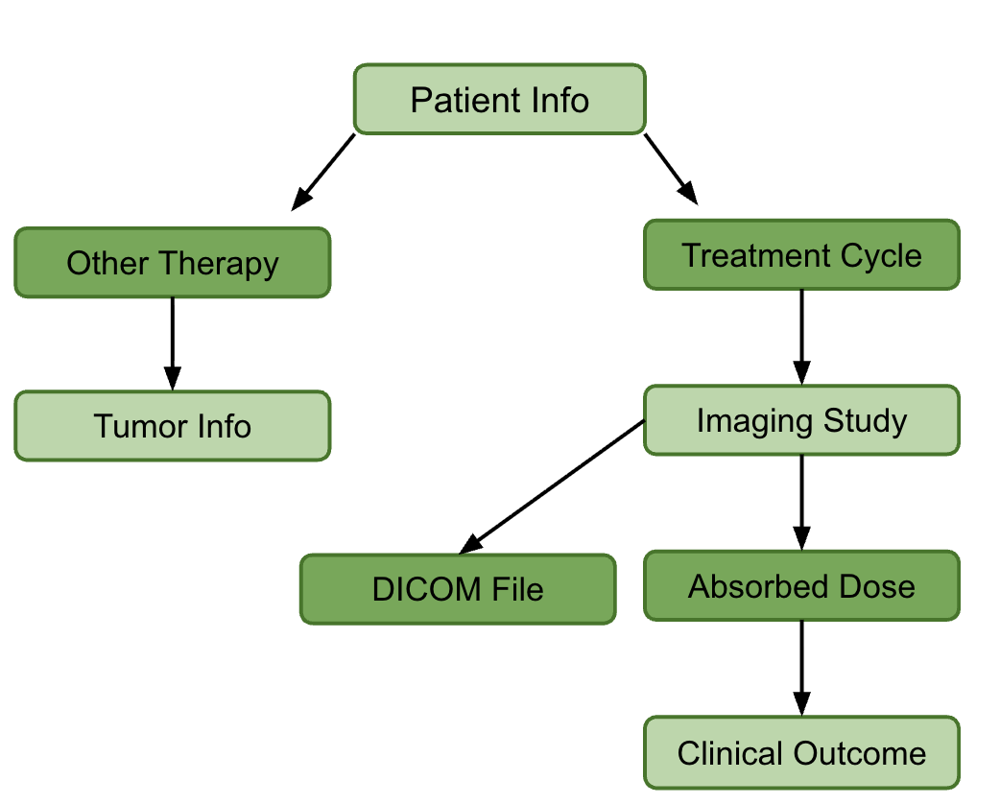

<h2>Radiology Database For Radionuclide Cancer Therapy</h2>

Motivation: Radionuclide therapy involves using pairs of radioactive isotopes to both treat a tumor and image the tumor in a scanner. These scans produce much data in the form of DICOM files, which can contain various formats of metadata about the patient, isotope treatment, and scanner. However, these scans are not always harmonized across institutions or scanner, making comparison and later use in predictive models very difficult. 

This web server is intended to be a centralized database for these DICOM scans that harmonizes the metadata so that it is readable and comparable. In the DICOM table page, the scan can be viewed and segmented via the multi-threaded segmentation algorithm, which uses a binary mask to calculation lesion volume. 

In the future, I intend to create a pipeline so that the absorbed dose can be calculated and used to train predictive models. These predictive models will help determine optimized treatment over time so that patients do not have as much of a burden in scanning. 

<h3>Set Up</h3>
Run "uv sync" to download all dependencies

Example DICOM file data for upload is located in the mock_data/ folder 

<h3>Usage Example</h3>
Click the "add patient" button to add patient data and fill out the form.

When the name of the patient is clicked, the patient detail page shows. This page contains all the data tables, including the Treatment Cycles, Imaging Studies, DICOM file metadata, Absorbed Dose, and Clinical Outcomes. 

DICOM files from the mock_data folder can be uploaded into the DICOM table. Upload the scan first so that the form auto-populates, then add the imaging study. Afterwards, clicking on the image link in the patient-detail page will show the scan. 

<h3>File Structure</h3>

views.py: contains the index, add_patient page, patient_detail page, and DICOM_viewer page

models.py: contains the models for the database. 

segmentation.py: contains the async segmentation function for the DICOM files, using a binary mask algorithm to get tumor voxels

